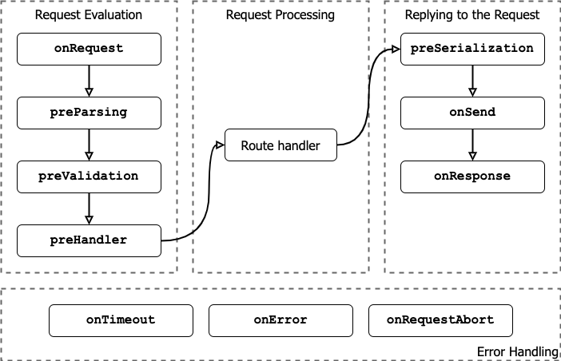
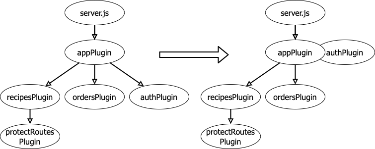

# Working with Fastify – The Web Framework

We learned about the low-level APIs provided by Node.js core for building web applications.
However, using those APIs can be challenging sometimes, demanding substantial effort to translate
conceptual ideas into functional software. For this reason, web frameworks are pivotal for quickly
developing robust HTTP servers within the Node.js ecosystem. A web framework abstracts web
protocols into higher-level APIs, allowing you to implement your business logic without the need to
address everyday tasks, such as parsing the body of an HTTP request or reinventing an internal router.

This chapter introduces Fastify, the fastest web framework with the lowest overhead available for Node.
js. Fastify places a high emphasis on enhancing the developer’s experience, powering you to build APIs
while ensuring outstanding application performance. It closely adheres to web standards, ensuring
compatibility and reliability. Moreover, it boasts an impressive degree of extensibility, enabling you
to customize your server to align precisely with your unique requirements.

Fastify (<https://fastify.dev/>) is a Node.js web framework for constructing web applications.
It facilitates the development of an HTTP server and the creation of your API in a straightforward,
efficient, scalable, and secure manner. The first Fastify’s stable release dates back to 2018. Since then,
it has garnered a substantial community, boasting over 7 million monthly downloads. Moreover, it
maintains a consistent release schedule, with a major version update approximately every two years.

Because practical experience is often the most effective way to learn, in this chapter, we will undertake
the implementation of an API server for our brand-new fantasy restaurant! Our objectives encompass
displaying the menu, allowing the chef to add or remove recipes, and enabling guests to place orders
that the chef will receive and cook!

**Important note:**
The `app.js` file serves as the entry point for our application. We have chosen to export the
recipe’s code in a format that is compatible with `fastify-cli` (<https://github.com/fastify/fastify-cli>).
This tool is designed to facilitate application startup and enhance
our developer experience. While we won’t delve into its details in this book, it’s worth noting
that the code we write here will provide you with the flexibility to transition to `fastify-cli`
seamlessly, should you choose to do so in the future.

The `server.js` file has a singular purpose; it imports the `app.js` file and uses the `options` object to
instantiate the root application instance.

The noteworthy addition here is the `register()` method. This Fastify function attaches plugins
to the Fastify server, ensuring that they are loaded sequentially according to the order in which they
are registered. After registering a function plugin, it is not executed until we execute the `listen()`,
`ready()`, or `inject()` methods.

This minor refactoring represents a significant step forward, as it bolsters our confidence in understanding
the Fastify plugin interface. Moreover, it neatly separates the business logic from the technical task
of launching the web server. As a result, the `server.js` file will never change, allowing us to focus
on the `app.js` file exclusively.

## Adding routes

To specify how the application responds to client requests, routes must be defined. Each route is
identified mainly by an HTTP method and a URL pattern, which must align with the incoming request
to execute the associated handler function. We are currently exposing only one single route: `GET /`.
If you try to hit a different endpoint, you will receive a 404 Not Found response:

```Bash
$ curl http://localhost:3000/example
{"message":"Route GET:/example not found","error":"Not
Found","statusCode":404}
```

Fastify automatically handles 404 responses. When a client attempts to access a non-existent route,
Fastify will generate and send a 404 response by default.

As we’re developing a web server to provide APIs for our fantasy restaurant, it’s essential to outline
the routes we need to implement in order to fulfill our objectives. Some of the necessary routes may
include the following:

- `GET /menu`: Retrieves the restaurant’s menu

- `GET /recipes`: This replies with the same logic as the `GET /menu` handler

- `POST /recipes`: Enables the chef to add a new dish to the menu

- `DELETE /recipes/:id`: Allows the chef to remove a recipe from the menu

- `POST /orders`: Allows guests to place orders for dishes

- `GET /orders`: Returns a list of the pending orders

- `PATCH /orders/:orderId`: Enables the chef to update the status of an order

To implement all these routes effectively, we should follow an iterative approach, continuously enhancing
our code with each iteration. The steps for our development process will be as follows:

1. **Define the route handlers:** Begin by defining the route with an empty handler. We will cover
   it in this recipe.

2. **Implement route logic:** Incorporate the necessary logic within your route handlers to handle
   tasks, such as retrieving the menu, adding new menu items, processing orders, and updating
   order statuses. We will do this in the Implementing authentication with hooks recipe.

3. **Validation and error handling:** Implement validation checks to ensure that incoming data are
   accurate and handle errors gracefully by providing informative error messages and appropriate
   HTTP status codes.

4. **Testing:** Thoroughly test each route to confirm that it functions as expected. Consider various
   scenarios, including valid and invalid input. We will cover this in the Configuring and testing
   a Fastify application recipe.

5. **Documentation:** We must not forget to write up a comprehensive `README.md` file within
   our source code to ease our team’s work.

**Important note:**
Don’t mix async with sync: It’s crucial to emphasize that you cannot mix the async and sync
handler styles; otherwise, unexpected errors will appear on the console. As a key takeaway,
remember the following guidelines: if the handler is asynchronous, return the desired payload;
otherwise, if the handler is synchronous, you must use the `reply.send()` function to send
the response. In my experience, it is more effective to stick to the async style in a project to
avoid confusion across the team and with different backgrounds. Furthermore, the `reply`
object is a fundamental component of Fastify that provides additional utilities, enabling you
to customize the response code or append new response headers as needed.

In this new plugin, for the `./routes/recipes.js` declaration, we use the callback style.
It is crucial to note that we are calling the `next()` function at the end of the plugin.
If you omit it, Fastify will fail its startup and will trigger an
`FST*ERR*PLUGIN_TIMEOUT - Plugin did not start in time: 'recipesPlugin'. You may have forgotten to call 'done' function or to resolve a Promise error.`

The `curl` request illustrates how Fastify employs a default error handler; it captures any thrown errors
and responds with a 500 HTTP status code along with the error message.

In moving to the server’s log output instead, we should see the following alongside the logged error
stack trace:

```Bash
{"level":30,"time":1694013232783,"pid":1,"hostname":"MyPC","msg":"Log-
ging GET /menu from this"}
{"level":30,"time":1694013232783,"pid":1,"hostname":" MyPC ","re-
qId":"req-2","msg":"Logging GET /menu from request"}
```

When you utilize the request’s log, the log entry will incorporate a `reqId` field.
This feature proves quite useful in discerning which logs relate to a specific request,
facilitating the reconstruction of the entire sequence of actions an HTTP request has undertaken within the application.
Fastify assigns a unique identifier to each request by default, starting with `req-1` and incrementing the number.
Additionally, this counter resets to its initial state with every server restart.

**Important note:**
If you want to customize the request id, you have two options. You can configure the
`requestIdHeader` server option, instructing Fastify to extract the id from a specific HTTP
header. Alternatively, you can supply a `genReqId` function, granting you full control over
the id generation process. For further information, please refer to the official documentation
at <https://fastify.dev/docs/latest/Reference/Server>.

## Implementing authentication with hooks

We’ve already utilized Fastify plugins to organize routes and enhance the maintainability of our project,
but these are just some of the advantages that the Fastify **plugin system** provides. The key features of
the plugin system are as follows:

- **Encapsulation:** All the hooks, plugins, and decorators added to a plugin are bound to the plugin
  context, ensuring they remain encapsulated within the plugin’s scope.

- **Isolation:** Each plugin instance is self-contained and operates independently, avoiding any
  modifications to sibling plugins. This isolation ensures that changes or issues in one plugin
  do not affect others.

- **Inheritance:** A plugin inherits the configuration of its parent plugin, allowing for a hierarchical
  and modular organization of plugins, making it easier to manage complex application structures.

These concepts might appear complex at first, but in this recipe, we will put them into practical use.
Specifically, we will implement protection mechanisms for routes that only a chef should be able to
access. This is a crucial step to prevent misuse by unauthorized users who might attempt to make
destructive changes to the fantasy restaurant’s menu.

The authentication must grant access to a chef user to these endpoints:

- `POST /recipes`

- `DELETE /recipes/:id`

- `PATCH /orders/:orderId`

To streamline the logic, we define a chef as any HTTP request that includes the `x-api-key` header
with a valid secret value. The server must return a `401 – Unauthorized` HTTP response if the
authentication fails. This approach simplifies the verification process for chef access.

**Important note:**
Restarting the Fastify server by manually killing the Node.js process can be cumbersome. To
streamline this process, you can run the application using the `node --watch server.js`
argument. Node.js 20 introduces the watch mode feature, which automatically restarts the
process whenever a file changes, making development more efficient.

To implement the authentication, we need to follow these steps:
Edit the `routes/recipes.js` file by adding an `onRequest` hook.

A hook is a function that executes, as required, throughout the lifecycle of the application or
during a single request and response cycle. It provides the capability to inject custom logic
into the framework itself, enhancing reusability and allowing for tailored behavior at specific
points in the application’s execution.

Let’s see it in action by running these curl commands:

```Bash
$ curl -X POST http://localhost:3000/recipes
{"statusCode":401,"error":"Unauthorized","message":"Invalid API key"}
$ curl -X PATCH http://localhost:3000/orders/fake-id
{"statusCode":500,"error":"Internal Server Error","message":"Not implemented"}
$ curl -X GET http://localhost:3000/recipes/fake-id
{"statusCode":401,"error":"Unauthorized","message":"Invalid API key"}
```

We have introduced the `onRequest` hook. This means the `isChef` function will run whenever a new
HTTP request comes into the server. The logic of this hook is to verify the property of `request.headers`
to check whether the expected header has the `fastify-rocks` value. If the check is unsuccessful, the
hook throws an error after setting the HTTP response status code using the `reply.code()` method.

If we analyze the console output, we can see the plugin system in action:

- **Encapsulation:** We have incorporated a hook within the `recipesPlugin` function, and this
  hook’s function is executed for every route defined within the same plugin scope. As a result,
  the `GET /recipes` route returns a `401` error, demonstrating how hooks can encapsulate
  and apply logic consistently within a plugin’s context.

- **Isolation:** Whenever Fastify executes the `register()` method, it generates a new **plugin instance**,
  analogous to the `app` argument in the `plugin` function declaration. This instance
  acts as a child object of the `root application` instance, ensuring isolation from sibling
  plugins and enabling the construction of independent components. This isolation is why the
  `PATCH /orders/fake-id` request remains unaffected and continues to return the old
  Not implemented error. It highlights that the scope of `ordersPlugin` remains isolated
  from that of the `recipesPlugin`.

To evaluate the Inheritance feature, you must move the `onRequest` hook from the `routes/recipes.js`
file to the `app.js` file. After this modification, executing the previous curl commands
will indeed result in an `Unauthorized` error. This outcome occurs because both `ordersPlugin`
and `recipesPlugin` are children of the `appPlugin` plugin instance and inherit all of its hooks,
including the `onRequest` hook.

How can we resolve the current scenario where all our routes are protected? Exploring the plugin system
offers a multitude of approaches to achieve this objective, as it heavily relies on your project’s structure
and the contexts you need to consider. Let’s see two approaches for each plugin in the `routes/` folder.

The initial step involves centralizing the authentication logic; to facilitate this, we introduce **Decorators**.
Decorators empower you to enhance the default functionalities of Fastify components, minimizing code
duplication and providing rapid access to the application’s resources, such as a database connection.
A decorator can be attached to the server instance, the request, or the reply object; this depends on
the context it belongs to. Let’s add this to `app.js` after removing the `onRequest` hook:

```JavaScript
async function appPlugin (app, opts) {
  app.decorateRequest('isChef', function isChef () {
    return this.headers['x-api-key'] === 'fastify-rocks';
  });
  app.decorate('authOnlyChef', async function (request,
    reply) {
      if (!request.isChef()) {
        reply.code(401);
        throw new Error('Invalid API key');
      }
  });
  // ...
}
```

We’ve defined an `isChef` request decorator, enabling the execution of the `request.isChef()` function
within the `appPlugin` context and its child plugin instances. The logic within the `isChef` function is
straightforward, returning a Boolean value of `true` only when a valid header is detected. It’s important
to note that when we define a request or reply decorator, the `this` context refers to the request or reply
object, respectively. This context is crucial for accessing these objects within the decorator function.

Next, we introduced an instance decorator named `authOnlyChef`. This decorator exposes a function
with an identical API to the `onRequest` hook we previously defined. It can be accessed through the
`app.authOnlyChef` property, offering a convenient way to apply authentication logic specific to
chefs across various routes and plugins only when needed.

Defining decorators doesn’t execute any logic; for them to execute on their own, we need to utilize them
within our routes. Let’s proceed to the `routes/orders.js` file and modify the `/orders/:orderId`
route to implement protection:

```JavaScript
  app.patch('/orders/:orderId', {
    onRequest: app.authOnlyChef,
    handler: notImplemented
  });
```

We’ve configured the `onRequest` route’s option property to define a hook specific to this route.
Fastify provides you with granularity in hook attachment; you can assign a hook function to an entire
server instance or to an individual route. Additionally, you have the flexibility to set the `onRequest`
field as an array of hook functions, which will be executed in the order they are added. This allows
for precise control over the request processing flow.

This syntax is perfect when you have a few routes to set up, but what if we have a lot of routes to
protect? Let’s see what we can do in the `routes/recipes.js` file:

```JavaScript
function recipesPlugin(app, opts, next) {
 app.get('/menu', { handler: menuHandler });
 app.get('/recipes', { handler: menuHandler });
 app.register(async function protectRoutesPlugin(plugin,
  opts) {
  plugin.addHook('onRequest', plugin.authOnlyChef);
  plugin.post('/recipes', async function addToMenu
   (request, reply) {
   throw new Error('Not implemented');
  });
  plugin.delete('/recipes/:id', function removeFromMenu
   (request, reply) {
   reply.send(new Error('Not implemented'));
  });
 });
 next();
}
```

To streamline the protection of the recipes routes, which consists of both protected and public routes,
you can create a new `protectRoutesPlugin` plugin instance in `recipesPlugin`. Within this
context, you can add the `onRequest` hook to all the routes defined in that context. In this case, I’ve
named the first argument `plugin` to distinguish it from the `app` context. The `plugin` parameter
serves as a child context of `app`, inheriting all the hooks and decorators up to the root application
instance. This allows it to access the `authOnlyChef` function. Furthermore, we’ve moved only
the routes that require protection into this new plugin function, effectively isolating them from
the parent’s scope. Keep in mind that inheritance flows from parent to child contexts, not the other
way around. This approach enhances code organization and maintains the benefits of encapsulation,
isolation, and inheritance within the Fastify plugin system.

With the changes we’ve made, you can now execute the `curl` commands that were initially tested in
this recipe. You should expect to receive an `Unauthorized` error only for the routes that require
protection, while the other routes should remain freely accessible. This demonstrates the successful
implementation of authentication logic for selective route protection.

Fastify has two distinct systems that govern its internal workflow: the **application lifecycle** and the
**request lifecycle**. While Fastify manages these two lifecycles internally, it provides the flexibility for
you to inject your custom logic by listening to and responding to the events associated with these
lifecycles. This capability enables you to tailor the data flow around the endpoints according to your
specific application requirements and use cases.

When you are listening for events triggered by the application lifecycle, you should refer to the **application hooks**
(<https://fastify.dev/docs/latest/Reference/Hooks#application-hooks>).
These hooks allow you to intervene during server startup and shutdown. Here is a quick list of these hooks and when they are emitted:

| Hook name  | Emitted when…                                                                                                                                                                          | Interface                                                                                              |
| ---------- | -------------------------------------------------------------------------------------------------------------------------------------------------------------------------------------- | ------------------------------------------------------------------------------------------------------ |
| onRoute    | a new endpoint is added to the server instance                                                                                                                                         | It must be a sync function                                                                             |
| onRegister | a new encapsulated context is created                                                                                                                                                  | It must be a sync function                                                                             |
| onReady    | the application loaded by the HTTP server is notyet listening for incoming requests                                                                                                    | It can be a sync or an async function                                                                  |
| onListen   | the application is loaded, and the HTTP server is listening for incoming requests                                                                                                      | It can be a sync or an async function. It does not block the application startup if it throws an error |
| preClose   | the server starts the close phase and is still listening for incoming requests                                                                                                         | It can be a sync or an async function                                                                  |
| onClose    | the server has stopped listening for new HTTP requests and is in the process of stopping, allowing you to perform cleanup or finalization tasks, such as closing a database connection | It can be a sync or an async function. This hook is executed in reverse order                          |

It’s important to note that these hooks are executed in the order of their registration, except for the `onClose` hook, which
follows a reverse order of execution because it ensures that the resources created last are the first to be
closed, similar to how a **last-in-first-out (LIFO)** queue operates. This sequencing is essential for proper
resource cleanup during server shutdown. Another important aspect that Fastify ensures is that if any
of these hooks fail to execute successfully, the server will not start. This feature is valuable, as these
hooks can be used to verify the readiness of essential external resources before they are consumed by
the application’s handlers. It ensures that your application starts in a reliable state, enhancing robustness
and stability. It’s important to note that the rule of preventing server startup upon hook failure does
not apply to the `onListen` and `onClose` hooks. In these particular cases, Fastify guarantees that
all registered hook functions will be executed, regardless of whether one of them encounters an error.
This behavior ensures that necessary cleanup and finalization tasks are carried out during server
startup and shutdown, even in the presence of errors in some hooks.

The application hooks serve various purposes, but the main ones include the following:

- **Cache warm-up:** You can use the `onReady` hook to prepare and preload a cache when the
  server is about to start, which can significantly enhance the performance of your handlers.

- **Resource Check:** If your handlers rely on a third-party server or external resource, you can
  use these hooks to verify that the resource is up and running during server startup, ensuring
  that your application’s dependencies are available.

- **Monitoring:** These hooks are valuable for logging and monitoring server startup information, such
  as configuration details or reasons for server shutdown, aiding in debugging and observability.

- **Aspect-oriented programming:** By leveraging the `onRegister` and `onRoute` hooks, you
  can apply aspect-oriented programming techniques to manipulate route options and inject
  additional properties or behavior into your routes. This allows for the powerful customization
  and modularization of your application logic.

As an exercise, try to add these hooks into every application’s files:

```JavaSCript
app.addHook('onReady', async function hook () {
  this.log.info(`onReady runs from file
    ${import.meta.url}`);
});
app.addHook('onClose', function hook (app, done) {
  app.log.info(`onClose runs from file
    ${import.meta.url}`);
  done()
});

```

Indeed, the `this` keyword in the context of these hooks represents the Fastify instance, granting
you access to all of the server’s decorators and resources. This includes the application logger, which
can be accessed in the common and well-established Fastify style. It’s worth noting that, similar to
plugin declarations, the hooks in Fastify support both asynchronous and synchronous interfaces. In
the case of asynchronous hooks, you don’t need to take any specific actions. However, in the case of
synchronous hooks, you have access to a `done` argument, as shown in the `onClose` hook in the
previous code snippet. It’s essential to call this function within the synchronous hook to indicate
successful execution; otherwise, the hook pipeline will be blocked, and it will not complete until a
timeout occurs, potentially leading to the server’s shutdown.

After this comprehensive overview of the application hooks, let’s now shift our focus to the
**request hooks** (<https://fastify.dev/docs/latest/Reference/Hooks#requestreply-hooks>),
which are associated with the request lifecycle. This lifecycle delineates the various steps
that an HTTP request undergoes when it enters the server. You can visualize this process in the
following diagram:



The request lifecycle steps are represented with dashed boxes containing the hook names
triggered during that specific phase.
Let’s follow the path of an incoming HTTP request and describe
what happens inside Fastify in the order of occurrence:

1. **Route selection:** When an HTTP request is received, Fastify routes it to a specific handler based
   on the requested URL and HTTP method. If no matching route is found, Fastify’s default 404
   handler is executed.

2. **Request initiation:** After the route handler is determined, the `onRequest` hook is executed.
   During this phase, the request’s body has not been parsed yet. The request object does not
   contain the `body` property. This is an appropriate point to discard any requests that should not
   be processed, such as unauthorized ones. Since the request payload has yet to be read, server
   resources are not wasted on unnecessary processing.

3. **Request payload manipulation:** If the HTTP request is deemed processable, the `preParsing`
   hook provides access to the request’s payload stream, which can be manipulated. Common use
   cases include decrypting an encrypted request payload or decompressing user input.

4. **Payload validation:** Fastify includes a built-in validation system. You can modify the parsed payload before
   it undergoes validation by listening to the `preValidation` hook.

5. **Full request parsing:** Just before executing the route handler, which contains the business
   logic, the `preHandler` hook is executed. During this phase, the request is fully parsed, and
   you can access its content via the `request.body` field.

6. **Route handler execution:** The request enters the main route handler to execute the function
   associated with the route definition. When you use `reply.send()` or return a payload as
   the response, the last phase begins to send the response payload to the client.

7. **Payload serialization:** Before the serialization process occurs, the `preSerialization`
   hook is triggered. Here, you can manipulate the payload, adapt it to a specific format, or convert
   non-serializable objects into plain JSON objects.

8. **Response preparation:** The `onSend` hook is called just before sending the response payload
   to the client. It can access the serialized payload content and apply additional manipulations,
   such as encryption or compression.

9. **Request completion:** Finally, the last step in the request lifecycle is the `onResponse` hook.
   This hook is executed after the payload has been successfully sent to the client, marking the
   completion of the HTTP request.

Indeed, many things are involved when a simple HTTP request enters the Fastify server, as highlighted
in the request lifecycle. Moreover, the image illustrates three additional hooks dedicated to managing
errors that may occur throughout the entire request lifecycle. These error-specific hooks provide the
means to handle errors gracefully and effectively, ensuring the reliability and robustness of your Fastify
application. These three error-specific hooks in Fastify provide ways to manage different error scenarios:

- `onTimeout`: This hook is triggered when a connection socket is in an idle state. To enable this
  hook, you must set the server’s `connectionTimeout` option (the default value is `0`, which
  means disabled). The value you specify in milliseconds determines the maximum time the
  application has to complete the request lifecycle. If this time limit is exceeded, the `onTimeout`
  hook kicks in and closes the connection.

- `onError`: The hook is triggered when the server sends an error as the response payload to the
  client. It allows you to perform custom actions when errors occur during request processing.

- `onRequestAbort`: This hook is executed when a client prematurely closes the connection
  before the request is fully processed. In such cases, you won’t be able to send data to the client
  since the connection has already been closed. This hook is useful for cleaning up any resources
  associated with the aborted request.

You’ve now gained a comprehensive understanding of Fastify’s hooks, which will be invaluable as you
dive deeper into using the plugin system. So, let’s start to use all of Fastify’s powerful features, including
hooks, decorators, and plugins, to implement the fantasy restaurant business logic.

## Breaking the encapsulation

In this new recipe, we’ll delve deeper into the world of the Fastify plugin system, expanding our
understanding beyond what we’ve explored so far. Fastify offers a wide array of tools, each serving
specific purposes, and gaining familiarity with them will greatly enhance your ability to customize
and control various aspects of your application’s lifecycle and behavior.

### Getting ready

In the previous Implementing authentication with hooks recipe, we learned about various hooks,
but we didn’t see their practical application. Now, let’s apply our knowledge by developing a custom
authentication plugin. Currently, our authentication logic is dispersed across the `app.js` file, which
is then utilized by both `orders.js` and `recipes.js`. While it works, it lacks centralization. To
address this, we aim to create a company-wide plugin that can be easily integrated into all our projects,
providing standardized authentication logic right out of the box when registering the plugin.



In the image, every node represents a self-contained context. Thanks to the plugin system, each of
these contexts can possess its own hooks, decorators, and plugins. On the left side of the figure, you
can observe the current structure of our application. Notably, the decorators defined within the
`authPlugin` function are not accessible to either the `recipesPlugin` or `ordersPlugin`
functions due to isolation. To rectify this, we should consider relocating the `authPlugin` node
higher up in the tree structure. By doing so, the recipes and orders plugins would inherit the
decorators, allowing for seamless integration and functionality. Implementing this action would
entail having `server.js` register `authPlugin` and, subsequently, `authPlugin` register
`appPlugin`. While this approach would work, it leads to a source code that is challenging to
comprehend due to its complexity and nested dependencies. For this reason, in this case, we want
to **break the encapsulation**, as shown on the right side of the image.

Install a new module by running `npm install fastify-plugin@5`.

Wrap the `authPlugin` function with the `fastify-plugin`, as shown in the following
code snippet:

```JavaScript
import fp from 'fastify-plugin';
async function authPlugin (app, opts) {
  // ...
}
export default fp(authPlugin);
```

Upon restarting the server, everything should function as it did previously. This is because
breaking the encapsulation context is like using the parent Fastify instance. If we were to apply
`fastify-plugin` to every file we’ve implemented thus far, we would essentially consolidate
everything into a single context, equivalent to the root application context. Unfortunately, this
would result in the loss of all the capabilities provided by the plugin system. As a general rule
of thumb, you may use `fastify-plugin` exclusively for those plugins that you intend to
reuse across your organization.

As mentioned before the `onRoute` hook must be a synchronous function. It receives the route’s options as its first
argument. The purpose of this function is to check whether `routeOptions` includes an `auth`
flag set to `true`. If this condition is met, we inject the `authOnlyChef` decorator funcion
into `routeOptions.onRequest`.

It’s worth emphasizing that the code ensures `authOnlyChef` is the first function in the
`onRequest` chain. This is significant because Fastify executes these functions in the order
they appear. Additionally, it’s worth mentioning that the input `routeOption.onRequest`
can either be an array of hooks or a single function. The code example handles both scenarios
seamlessly using the `Array.concat()` function.

Now, we can go back to the `orders.js` file and update the `PATCH /orders/:orderId`
handler as follows:

```JavaScript
  app.patch('/orders/:orderId', {
    config: { auth: true },
    handler: notImplemented
  });
```

We have replaced the previous `onRequest [app.authOnlyChef]` configuration with
the new approach.

By utilizing the route’s `config` property, we isolate your application’s properties from Fastify’s fields to
prevent conflicts. This updated setup offers several advantages, including the ability of `authPlugin`
to evolve over time without necessitating changes to your routes’ configurations with every update.
This pattern aligns with **aspect-oriented programming**, as it dynamically introduces a feature through
a straightforward Boolean configuration.

## Implementing business logic using hooks

The APIs for the fantasy restaurant have a specific goal: to serve our restaurant’s needs. In the Adding
routes recipe, we examined the general flow but didn’t delve into details, such as the following:

- What constitutes the input for each endpoint?

- What should be the expected output of each service?

- Where should we store the data?

We require a database to store and retrieve application data. For this purpose, we will employ the
well-known NoSQL database MongoDB (<https://www.mongodb.com/>). MongoDB is a
popular NoSQL database that stores data in flexible, JSON-like documents, providing scalability and
high performance for various applications. It’s important to note that the details of MongoDB are not
the primary focus of this chapter, so I won’t delve into extensive descriptions of its inner workings.

**Important note:**
If you have a Docker installation, you can run a MongoDB server by running this command
line: `docker run -d -p 27017:27017 --name fastify-mongo mongo:8`. It
will start a container using the official MongoDB image, and it will be ready to use. Finally, to
stop it, you can run this command instead: `docker container stop fastify-mongo`.

**Important note:**
In the preceding code block, the `_id` property in `recipe._id = _id;` and the `id` property
in `recipe.id = _id.toString()` have the same value. We introduce the `id` property
to prevent the exposure of any information related to our database. While we utilize the `_id`
property, it is primarily defined and employed by MongoDB servers for internal purposes,
and we opt to use `id` to maintain a level of abstraction and security in our application’s data.

We can try the db now by running this curl command:

```Bash
$ curl -X POST http://localhost:3000/recipes -H "Content-Type: application/json" -H "x-api-key: fastify-rocks" -d '{"name":"Lasagna","country":"Italy","price":12}'

{"id":"64f9f3eaee2d03172a8c5efe"}
```

Our test is not over yet. You must try to run the same `curl` command, but you need to remove the
`x-api-key` header or change its value. We expect a `401 – Unauthorize` error in these cases.

**Important note:**
Instead of using `curl` to run HTTP requests against the application server, adopting an HTTP
Client with a graphic user interface (GUI) may be easier. Here is a complete list where you
may choose your favorite one: <https://github.com/mrmykey/awesome-http-clients/blob/main/Readme.md#gui>.

As usual, we can try to see if this code is working as expected by calling the server to see the result:

```Bash
curl http://localhost:3000/menu
```

The `/menu` endpoint should answer with an array of all the dishes we stored in the menu
collection during our testing phase!

**Important note:**
Should we implement pagination? Our `GET /menu` endpoint provides a list of data, and it’s
considered a best practice to assess whether the list might be excessively large to return in a
single HTTP call. In this specific case, it’s deemed acceptable to return the entire menu. However,
if the menu were to contain hundreds of recipes, you might want to consider implementing
pagination logic to break the data into manageable chunks. You can find guidance on how to
implement two different pagination patterns in this article:
<https://backend.cafe/streaming-postgresql-data-with-fastify>. Although the article discusses
PostgreSQL, these pagination patterns can also be adapted for use with MongoDB.

In this recipe, we’ve learned how to establish a connection to a database. It’s worth noting that Fastify
contributors provide support for various popular databases, including PostgreSQL, MySQL, and Redis,
among others. You can find a comprehensive list of supported databases at <https://fastify.dev/ecosystem>.
In the upcoming recipe, we will discuss the data validation used to protect our
endpoints from malicious users, and we will keep on implementing the missing routes’ handlers.

## Validating the input data

In the Implementing the business logic recipe, we stored input data from the `POST /recipes`
endpoint in the database. However, we did not implement any validation logic, which means we could
potentially insert a string into the price field or a recipe without name. Furthermore, it’s important
to consider security concerns, as a malicious user could potentially insert a recipe with a description
that’s excessively large, posing a risk to your application’s performance and storage.

In the backend world, there is a rule: never trust the user’s input. Fastify knows it well, so it integrates
a powerful and feature-complete validation process. Let’s see it in action.

The `jsonSchemaBody` constant is an object defined in the **JSON schema** format. This format
adheres to the specifications outlined in the JSON schema standard, which provides a framework
for describing the structure and constraints of JSON documents, including those in request
bodies. By employing a JSON schema interpreter, you can assess whether a given JSON object
conforms to a predefined structure and constraints, enhancing the validation process for your
API requests. Fastify includes the AJV (<https://ajv.js.org/>) module to process the
JSON schemas and validate the request’s components.

The route option `schema` property accepts these fields:

- `body`: This schema is used to validate the `request.body` during the request evaluation.

- `params`: This schema validates `request.params`, which contains the path parameters
  of the request URL.

- `headers`: It is possible to validate `request.headers`; therefore, we may improve the
  routes protected by the authentication by adding a JSON schema that requires the
  `x-api-key` header to be set.

- `query`: We can validate the `request.query` object that contains all the query string
  parameters by using this.

- `response`: This field is a special one, and it does not accept a JSON schema out of the box.
  We will see it in action in the next Enhancing application performance with serialization recipe.

Now, if we restart the server with the new route’s configuration, we will hit our first
`400 – Bad Request` response by running the same command:

```Bash
$ curl -X POST http://localhost:3000/recipes -H "Content-Type: application/json" -H "x-api-key: fastify-rocks" -d '{"name":"Lasagna","country":"Italy","price":12}'

{"statusCode":400,"code":"FST_ERR_VALIDATION","error":"Bad Request","message":"body must have required property 'order'"}%
```

It’s worth noting that, in your scenario, you received only a single error message when you
expected two errors to be reported:

- I.
  The first error should relate to the incorrect `country` value. The JSON schema specifies
  an enumeration of just two ISO codes, and the provided value doesn’t match either of them.

- II.
  The second error pertains to the missing `order` property, but it seems that only this
  error is being displayed in the output message.

This situation occurs due to the default AJV configuration that Fastify uses. You can check the default
setup at <https://github.com/fastify/ajv-compiler#ajv-configuration>:

```JavaScript
{
  coerceTypes: 'array',
  useDefaults: true,
  removeAdditional: true,
  uriResolver: require('fast-uri'),
  addUsedSchema: false,
  allErrors: false
}
```

To resolve the issue and enable the `allErrors` option, you should configure the server’s
`option` object that is exported in the `app.js` file. Here’s how you can modify the configuration:

```JavaScript
const options = {
  logger: true,
  ajv: {
    customOptions: {
        allErrors: true
    }
  }
};
```

By restarting the application and re-running the `curl` command, we should get this new output:

```Bash
{"statusCode":400,"code":"FST_ERR_VALIDATION","error":"Bad Request","message":"body must have required property 'order', body/country must be equal to one of the allowed values"}
```

Note that the `ajv.customOptions` field will be merged with the default configuration, so verify
each option and set it as it best fits your needs. The validation step is one of the most important
and requires additional care to secure your APIs. Let me suggest my preferred configuration:

```JavaScript
customOptions: {
  removeAdditional: 'all'
}
```

The `removeAdditional` option will enforce the removal of all input fields that are not
explicitly listed in the route’s JSON schemas. This feature is a valuable addition to enhance
security. It’s important to note that if you do not specify a JSON schema for a particular route,
the removal logic will not be applied, and all input fields will be retained as-is.

The route’s definition incorporates a JSON schema in the `schema.params` property to
validate the input `id`. We perform a strict check to ensure that `id` is exactly 24 characters in
length, which is a security measure to prevent potential long code injection attacks. Note that
this validation is strictly related to MongoDB, and it demonstrates how you can protect your
routes from bad actors. So, tweak this configuration based on your needs.

Meanwhile, in the `removeFromMenu` function implementation, we retrieve the recipe from
the database by first reading it. Note the use of array destructuring because the `readRecipes`
function returns an array. If the item is missing in the database, we will return a
`404 - Not Found` error. Otherwise, we delete the record and return a `204` response status code, indicating
a successful deletion.

It is time to test our code. Therefore, we can try the curl commands as usual:

```Bash
$ curl -X POST http://localhost:3000/recipes -H "Content-Type: application/json" -H "x-api-key: fastify-rocks" -d '{"name":"Lasagna","country":"ITA","price":12,"order":1}'

{"id":"64fad8e761d11acc30098d0c"}

$ curl -X DELETE http://localhost:3000/recipes/111111111111111111111111 -H "x-api-key: fastify-rocks"

{"statusCode":404,"error":"Not Found","message":"Not found"}

$ curl -X DELETE http://localhost:3000/recipes/64fad8e761d11acc30098d0c -H "x-api-key: fastify-rocks"
```

In this recipe, we’ve successfully implemented all the routes defined in the `routes/recipes.js` file.

In the upcoming recipe, we will continue by implementing the routes defined in `routes/orders.js`
while also introducing another exciting Fastify feature: serialization!

## Enhancing application performance with serialization

The serialization step converts the high-level data generated by business logic, including JSON objects
or errors, into low-level data, such as strings or buffers, which are then sent as responses to the client’s
requests. It involves the transformation of intricate objects into an appropriate data type that can be
effectively transmitted to the client. In fact, as mentioned in the Implementing authentication with hooks
recipe, the serialization process is initiated only if the route handler doesn’t return a string, stream, or
buffer, as these objects are already serialized and prepared for transmission as HTTP responses to the
client. Nevertheless, this process can’t be avoided when you work with JSON objects.

Fastify incorporates a serialization module that facilitates the conversion of an object into a JSON string,
leveraging a JSON schema definition. This module, known as `fast-json-stringify`, offers a
notable performance boost when compared to the standard `JSON.stringify()` function. In fact,
it accelerates the serialization process by a factor of two for small payloads. Its performance advantage
shrinks as payload grows, as demonstrated in their benchmark, which is available at
<https://github.com/fastify/fast-json-stringify/>.

Since we need to deal with user input, we can define this JSON schema:

```JavaScript
  const orderJsonSchema = {
    type: 'object',
    required: ['table', 'dishes'],
    properties: {
      table: { type: 'number', minimum: 1 },
      dishes: {
        type: 'array',
        minItems: 1,
        items: {
          type: 'object',
          required: ['id', 'quantity'],
          properties: {
            id: { type: 'string', minLength: 24,  maxLength: 24 },
            quantity: { type: 'number', minimum: 1 }
          }
        }
      }
    }
  };
```

It defines two properties:

- `table`: This helps us understand which customer ordered.

- `dishes`: This is a JSON object array that must have at least one item. Every item must contain the recipe `id` and `quantity`.

Thanks to the JSON schema, we can avoid a lot of boring if statements and checks such as
checking if the `quantity` input field is a negative value!

We are ready to try the route out:

```Bash
$ curl -X POST http://localhost:3000/orders -H "Content-Type:application/json" -d '{"table":42,"dishes":[{"id":"64fad-8e761d11acc30098d0c","quantity":2},{"id":"64fad8e761d11ac-c30098d0z","quantity":1}]}'

{"id":"64faeccfac24fcc42c6ffda8"}
```

The `readOrders` function introduces a more comprehensive logic compared to what we saw
earlier in Step 5. Here’s an overview of the steps it takes:

- I. Initially, it reads all the pending orders.

- II. Then, it collects all the recipe IDs used across all the orders to optimize performance by running a single query to select only those recipes that are actually used.

- III. Finally, it iterates through the orders array to replace the items array, which was initially read from the database, with the corresponding recipe items from the database.

It’s worth mentioning that we have seen how to use multiple datasource methods in one handler.
If we would like to optimize the code even further, we could use a MongoDB `$lookup` to run
a single query to the database instead of two, as we did.

One notable detail is the use of a filter to skip recipes that were not found in the system. This
is an edge case consideration because an order may include a recipe that was deleted after it
was created, and in such cases, we want to ensure that these deleted recipes are not displayed
in the output. We are ready to test this implementation by executing a command in the shell:

```Bash
$ curl http://localhost:3000/orders
```

We expect a big output displaying the orders in our system. Here is an example of one order output:

```Bash
[
  {
    "status": "pending",
    "createdAt": "2023-09-08T09:56:49.750Z",
    "items": [
      {
        "name": "Lasagna",
        "country": "ITA",
        "description": "Lasagna is a traditional Italian dish made with alternating layers of pasta, cheese, and sauce.",
        "order": 1,
        "price": 12,
        "quantity": 1,
        "createdAt": "2023-09-08T09:54:28.904Z",
        "id": "64faefcc9094146c83d2ffd7"
      }
    ],
    "id": "64faefe19094146c83d2ffd8"
  }
]
```

As you can see, the provided information contains more details than the target user requires.
It’s time to configure the serialization process to ensure that the data presented to the user is
concise and relevant to their needs.

The `orderListSchema` specifically outlines the fields we desire in the response payload, mapping
only the properties’ types without specifying attributes to define the maximum string length or
valid number ranges. It’s worth noting the `format` attribute, which allows for the customization
of the output for a date field. However, it’s important to clarify that this concept can sometimes
be misunderstood: the JSON schema used for serialization does not apply any validation but
solely filters the data. Therefore, any additional validation rules added to the JSON schema will
be ignored during the serialization process.

To use a JSON schema during serialization, it’s essential to configure the `schema.response`
object. Notably, you can specify the HTTP status codes to which the particular schema should be
applied. You have the flexibility to define different schemas for various status codes. Additionally,
there’s another convenient Fastify pattern that you can utilize. By setting the `"2xx"` property
within the schema, it will be used for all HTTP status codes ranging from `200` to `299`, simplifying
the schema configuration for a range of successful responses.

If we run the curl command fagain, we will get even better output:

```Bash
[
  {
    "id": "64faefe19094146c83d2ffd8",
    "createdAt": "2023-09-08T09:56:49.750Z",
    "items": [
      {
        "name": "Lasagna",
        "order": 1,
        "quantity": 1
      }
    ]
  }
]
```

By successfully implementing a JSON schema for serializing the output of the order endpoint,
you’ve enhanced both the speed and security of your application. This approach ensures that
only the designated fields are returned, safeguarding against the inadvertent exposure of sensitive
data as the database evolves over time. Specifying a JSON schema as part of your response is
consistently considered good practice for maintaining control over the data exposed to clients
and enhancing overall security.

We can consider the overall application complete. While there is room for further improvements,
such as adding a JSON schema to all the routes, it might be considered optional
to delve into this in detail since we’ve already covered the fundamental concepts behind it.

## Configuring and testing a Fastify application

An application truly achieves completeness only when it has a comprehensive test suite, in this recipe, our
focus shifts to testing our endpoints to assert their functionality and correctness. This testing ensures
that as we make changes to the code in the future, we can reliably verify that we have not introduced
any new bugs or regressions.

We will use the new Node.js test runner in this recipe where we will cover the
basics to get you started with testing.

We will begin this recipe by reading the application’s configuration, followed by writing application tests.
Up until now, we’ve hardcoded certain elements in our code, including the following:

- The database connection URL

- The API key for authentication

However, this approach isn’t ideal for our application because we should have the flexibility to change
these values as needed, especially in different environments. The best practice in such cases is to access
the environment variables provided by the system. Additionally, this is a requirement for writing tests,
allowing us to inject different configurations as necessary for testing various scenarios and environments.

We need to create a new file, `plugins/config.js`

The plugin code should be fairly understandable, even if you’re encountering it for the first time.
This plugin defines an `envSchema` constant with a JSON schema. This schema is subsequently
used as a configuration for the `@fastify/env` module. This module validates the `process.env`
object against the provided input schema. Consequently, if the required configuration is
missing or incorrect, the application will not start successfully. Moreover, the `confKey` option
lets you set a custom name for the server decorator that this module is going to add.

If you register this plugin in the `app.js` file and attempt to restart the server, you will encounter
an error during the startup process:

```Bash
Error: env must have required property 'API_KEY', env must have required property 'DATABASE_URL'
```

To fix this configuration issue, we need to begin passing the `opts` argument in our plugin
declarations. Let’s address this problem using a top-down approach.

Lets update `server.js` adding `applicationEnv`.

We introduced a configuration object during the registration of `appPlugin`. The
`applicationEnv` property is derived from merging `process.env` with the default
values specified in the code. In cases where `process.env` contains values for `API_KEY`
or `DATABASE_URL`, these environment-specific values take precedence over the defaults
defined in the code.

Now, we need to go back to `app.js` and update it accordingly:

```JavaScript
import configPlugin from './plugins/config.js';
// ...
async function appPlugin (app, opts) {
  // ...
  app.register(configPlugin, opts);
  // ...
}
```

In this context, the `opts` argument corresponds to the second object parameter we recently
added in the `server.js` file. Consequently, `configPlugin` also receives the same object
because we added it during the registration. If we refer back to the initial code snippet in this
recipe, which showcases the `configPlugin` implementation, you’ll observe that we’ve already
supplied the `opts.applicationEnv` option to `@fastify/env`. This indicates that it’s
now reading the correct configuration.

With these adjustments, we should be able to restart the server successfully.

We have changed a lot of code but still need to remove the hardcoded configuration from the
plugins. Let’s do it now, starting with the app.js file:

```JavaScript
async function appPlugin (app, opts) {
  // ...
  await app.register(configPlugin, opts);
  app.register(datasourcePlugin, { databaseUrl: app.appConfig.DATABASE_URL });
  app.register(authPlugin, { tokenValue: app.appConfig.API_KEY });
}
```

In this code snippet, you’ll notice a new syntax: `await app.register()`. Now, `await`
is crucial because, without it, your server won’t start. As a reminder, in the Splitting the code
into small plugins recipe, we discussed that plugin functions are not executed until one of the
following methods is called: `app.listen()`, `app.ready()`, or `app.inject()`. While
this principle remains accurate, using `await app.register()` effectively triggers Fastify
to initiate the loading process up to the awaited line, ensuring the necessary setup occurs before
further execution. In fact, we use the `app.appConfig` decorator in the following line, and
this field will remain undefined if we don’t wait for (await) `configPlugin`.

Now we achieved a dynamic application that adapts its configuration based
on the environment, validates prerequisites before starting, and leverages another feature of
Fastify’s plugin system by utilizing the ability to await a plugin. Additionally, you’ve improved
the authentication and data source plugins, making them more configurable and suitable for
use across your organization’s projects. By configuring the plugins via the `register` method,
we can create plugins that are decoupled from the rest of the application and do not require
the `app.appConfig` decorator to work.

With all these pieces in place, you’re well prepared to begin writing your test suite.

Your Fastify application can be effectively represented by the `appPlugin` instance and the
server’s configuration exported by the `app.js` file. In fact, there is minimal value in testing
the `server.js` file, as it primarily serves as a straightforward runner that can be readily
replaced by the `fastify-cli` module when necessary.

To run the test file, we need to execute this command:

```Bash
$ node --test test/app.test.js

✔ GET / (215.621999ms)
✔ An unknown user cannot can create a recipe (67.551107ms)
✔ Only a Chef can create a recipe (87.380888ms)
✔ Create an order and mark it as done (140.813504ms)
ℹ tests 4
ℹ suites 0
ℹ pass 4
ℹ fail 0
ℹ cancelled 0
ℹ skipped 0
ℹ todo 0
ℹ duration_ms 1212.161848
```

`test/helper.js` exports a `buildApplication` function that instantiates the Fastify root
server instance and registers `appPlugin`, as carried out by the `server.js` file. The differences
are the following:

- The app constant is just returned, and we do not call the `listen()` method. In this way, we
  are not blocking a host’s port.

- The default server’s options are the same as `server.js` with the logger turned off. Anyway,
  we can customize them by providing a second argument to the factory function.

- The default environment setup does not read the `process.env` object, but it defines good
  defaults with which to run the application in every local development environment.

As we are running the application, a connection to the database will be established. To ensure the
test completes successfully, it’s essential to close the server and database connection after the test has
executed all the assertions. This cleanup step is crucial for the proper functioning of subsequent tests
and to avoid resource leaks.

Lastly, we can use Fastify’s `app.inject()` method. Unlike calling the `listen` method, this
approach starts the server without actively listening for incoming HTTP requests, enabling faster
execution. The `inject` method then generates a simulated HTTP request and sends it to the server,
which processes it in the same way it would a genuine request, producing an HTTP response. This
method returns the HTTP response, allowing us to verify its content to validate our expectations.
The `inject` method accepts an object parameter for specifying various HTTP request components.

At the end of the test case, we assert that the response has the correct status code and payload.

The test output provides a summary of the entire execution process. In the event of an error, it displays
a detailed message indicating the failed assertion. For experimental purposes, you can attempt to
break the test by modifying the `deepStrictEqual` check, for instance, by editing the `version`
property. This will help you observe how tests respond to changes and failures, allowing you to refine
and improve them as needed.

Before wrapping up this recipe, it would be useful to check a more complex test case, so let’s quickly
analyze this code:

```JavaScript
test('An unknown user cannot create a recipe', async function (t) {
  const testApiKey = 'test-suite-api-key';
  const app = await buildApplication({
    API_KEY: testApiKey
  });
  t.after(async function () {
    await app.close();
  });
  const pizzaRecipe = { name: 'Pizza', country: 'ITA',
    price: 8, order: 2 };
  const notChefResponse = await app.inject({
    method: 'POST',
    url: '/recipes',
    payload: pizzaRecipe,
    headers: {
      'x-api-key': 'invalid-key'
    }
  });
  strictEqual(notChefResponse.statusCode, 401);
});
```

This new test case examines the A unknown user cannot create a recipe condition. In
this scenario, we inject a custom API key within the `buildApplication` function and subsequently
confirm that if the `POST /recipes` request lacks the valid header, it will be rejected. We saw also
that the `inject` method accepts the payload and headers fields to control every request’s aspect.

Furthermore, we can enhance the code by introducing an additional test case to ensure that a valid
chef can, indeed, create a recipe and that the newly created recipes appear on the menu. This additional
test will further validate the application’s functionality:

```JavaScript
test('Only a Chef can create a recipe', async function (t) {
  const testApiKey = 'test-suite-api-key';
  const app = await buildApplication({
    API_KEY: testApiKey
  });
  t.after(async function () {
    await app.close();
  });
  const pizzaRecipe = { name: 'Pizza', country: 'ITA',
    price: 8, order: 2 };
  const response = await app.inject({
    method: 'POST',
    url: '/recipes',
    payload: pizzaRecipe,
    headers: {
      'x-api-key': testApiKey
    }
  });
  strictEqual(response.statusCode, 201);
  const recipeId = response.json().id;
  const menu = await app.inject('/menu');
  strictEqual(menu.statusCode, 200);
  const recipes = menu.json();
  const expectedPizza = recipes.find(r => r.id ===
    recipeId);
  ok(expectedPizza, 'Pizza recipe must be found');
});
```

Note that the `app.inject()` method has a shortcut to run simple `GET` requests also. It requires
the URL string only.

Throughout this chapter, you’ve delved into some of Fastify’s most crucial features, including the
plugin system and the wide number of hooks. You’ve also gained insights into the essential aspects
of a Fastify application, such as configuration and code reusability. Moreover, your proficiency in
working with MongoDB has undoubtedly improved.
